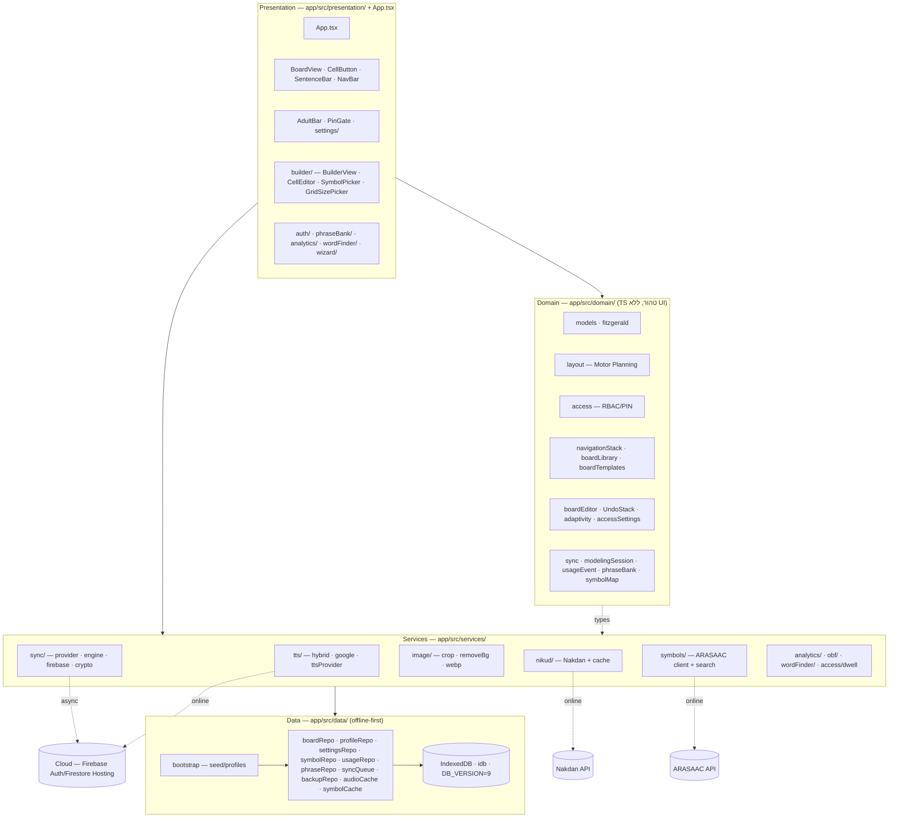

# ARCHITECTURE — לוח תקשורת (AAC)

> מבט ארכיטקטוני. לסקירה כללית ומצב עדכני ראה `docs/reviews/HANDOFF.md`; לאפיון מלא `PRD/PRD-he.md`.
> כל הקוד תחת `app/src/`. ארכיטקטורת 4-שכבות חד-כיוונית: התלות זורמת כלפי מטה בלבד.

## Module diagram

## Module responsibilities

| שכבה | מודול | אחריות |
|------|-------|--------|
| Presentation | `App.tsx` | מעטפת, state ראשי, ניתוב פעולות `onCell`, מצב נעול/מבוגר, init של services |
| Presentation | `BoardView`/`CellButton`/`SentenceBar`/`NavBar` | רינדור לוח RTL, לחיצת תא, שורת משפט, ניווט קבוע |
| Presentation | `builder/` | עריכת לוח (drag-drop, undo/redo, multi-select, preview), עריכת תא, בחירת סמל |
| Presentation | `auth/ · settings/ · phraseBank/ · analytics/ · wordFinder/ · wizard/` | פאנלים למבוגר בלבד |
| Domain | `layout` | אינווריאנט Motor Planning — מילות ליבה לא זזות |
| Domain | `access` | RBAC, אימות PIN, הרשאות עריכה |
| Domain | `boardLibrary`/`boardTemplates`/`navigationStack` | לוחות מוכנים, תבניות, מחסנית ניווט |
| Domain | `boardEditor`/`adaptivity`/`accessSettings` | עריכה immutable, הסתרה/גריד דינמי, הגדרות גישה |
| Domain | `sync`/`modelingSession`/`usageEvent`/`phraseBank`/`symbolMap` | מיזוג גרסאות, מודלינג, אירועי שימוש, מיפוי סמלים |
| Services | `tts/` | TTS היברידי: cache→online→fallback אופליין |
| Services | `nikud/` | ניקוד אוטומטי (Nakdan) + cache + override ידני |
| Services | `image/` | crop · removeBackground (fallback) · compressToWebP (Canvas, offline) |
| Services | `symbols/` | חיפוש ARASAAC + cache offline |
| Services | `sync/` | provider אגנוסטי, engine (debounce/offline-safe), Firebase, crypto AES-GCM |
| Services | `analytics/ · obf/ · wordFinder/ · access/dwell` | תיעוד opt-in · OBF · חיפוש נתיב · hooks גישה |
| Data | `db` + `*Repo` | IndexedDB מקור-אמת מקומי; load/save/list; מחיקה=ארכוב |
| Data | `bootstrap` | seed ספריית לוחות + פרופיל דמו; createProfile (קלון) |

## Communication boundaries
- **חד-כיווני:** Presentation → Domain → Services → Data. שכבה לא קוראת כלפי מעלה.
- **Domain = TS טהור** — ללא תלות ב-React/DOM/IndexedDB; ניתן לבדיקה בבידוד (זה מה שמאפשר 244 טסטים).
- **Data = הגבול היחיד ל-IndexedDB.** כל גישה ל-DB עוברת דרך `*Repo`; שאר השכבות לא נוגעות ב-`idb` ישירות.
- **רשת = אופציונלית בלבד.** services/tts·nikud·symbols·sync יוצאים לרשת רק כשיש; כל אחד נופל חיננית למצב מקומי/cache (אינווריאנט offline-first).
- **Cloud מאחורי interface** (`SyncProvider`) — backend-אגנוסטי; `LocalStubProvider` לבדיקות, `FirebaseProvider` בייצור (רק כש-syncEnabled && authUser).
- **מיגרציות DB** רק ב-`data/db.ts` `upgrade`, תמיד אדיטיביות.
