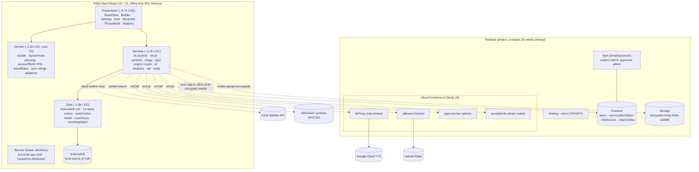

# 00 — Discovery: Current State of Co_Board

> 📚 Part of the SaaS transformation docs — see [README.md](README.md) for the full index: [00](00-discovery.md) · [01](01-audit.md) · [02](02-ux-a11y-platforms.md) · [03](03-privacy-security-family.md) · [04](04-media-ai.md) · [05](05-roadmap.md) · [06](06-executive-summary.md) · [Session summary](SESSION_SUMMARY.md)

> Stage A output of the SaaS transformation plan (see `COBOARD_TASK.md`, Part 1).
> Produced by: Scout (repo scan) + Analyst cross-check against `ARCHITECTURE.md`, `docs/reviews/HANDOFF.md`, and source.
> Date: 2026-07-07 · Branch: `claude/coboard-saas-strategy-1c74cn`
> Source of truth: code > docs. Contradictions found are flagged inline.

---

## 1. Executive snapshot

Co_Board is **not** a raw experiment — it is a mature, well-architected Hebrew-first AAC PWA MVP:

- **~16,000 LOC** app source (excl. tests) + **~450 LOC** Cloud Functions, in a strict 4-layer unidirectional architecture (Presentation → Domain → Services → Data).
- **244 unit tests passing** (72 test files, Vitest + fake-indexeddb), **6 Playwright e2e specs** incl. axe accessibility scans, **Firestore rules tests** under emulator.
- **Offline-first is real**: IndexedDB (schema v12) is the local source of truth; network (TTS, nikud, symbols, sync) is optional with graceful fallback.
- **Security baseline already decent**: strict CSP, server-side API keys (Secret Manager), per-uid rate limiting, approval-gated users, E2E media encryption (AES-GCM) before upload.
- Prior audit cycle ("Ultra Review", 2026-07) completed refactor Phase 2 and most of hardening Phase 3.

The gap to a commercial SaaS is **not code quality** — it is: multi-tenancy/family-role model, billing, i18n framework, native mobile delivery, compliance formalization (Israeli Privacy Law / תקנות אבטחת מידע, COPPA-like consent), observability, backup/DR, and a design-system-driven UX overhaul.

---

## 2. Stack (verified from source)

| Layer | Technology | Notes |
|---|---|---|
| Frontend | React 18.3 + TypeScript 5.5 (strict, zero `any`) | `app/` |
| Build | Vite 7.3.6 + vite-plugin-pwa 1.3 (Workbox) | PWA autoUpdate SW |
| Local data | IndexedDB via `idb` 8, DB_VERSION=12, additive migrations only | 14 object stores |
| Cloud | Firebase: Auth, Firestore, Storage, Hosting, Functions v2 (Node 20) | project `co-board` |
| Functions region | `europe-west1` primary + `us-central1` legacy (dual-deploy) | GDPR positioning |
| TTS | Hybrid: audioCache → Google Cloud TTS (Neural2/Wavenet, via `ttsProxy` CF) → browser `speechSynthesis` fallback | 4 Hebrew voices |
| Nikud | Dicta Nakdan API (gated by `VITE_NAKDAN_ENDPOINT`) + IndexedDB cache + manual override | ⚠️ licensing unresolved (ADR-0005) |
| Symbols | ARASAAC API + offline cache (CacheFirst SW, 3,000 entries / 90d TTL) | free/CC source |
| AI | Gemini Flash via `aiBoard` CF (topic → board word list JSON) | rate-limited, approved-users only |
| Images | Client-side crop / background-removal fallback / WebP compression (Canvas, offline) | |
| Testing | Vitest 3 + coverage-v8, Playwright 1.61 + @axe-core/playwright, rules-unit-testing | |
| Lint/CI | ESLint 9 flat config, GitHub Actions (ci.yml, deploy.yml), Dependabot | |
| State mgmt | React local state + custom hooks (`presentation/app/`), no Redux/router — custom navigation stack | adequate at current size |

**External services NOT present:** no analytics SaaS, no error tracking (Sentry deliberately deferred pending COPPA/privacy decision), no push notifications, no email/SMS, no payment provider.

---

## 3. Current-state architecture diagram

---

## 4. Data model

### 4.1 Firestore (cloud, sync target)
| Collection | Purpose | Access control |
|---|---|---|
| `users/{uid}` | account, `status: pending/approved/rejected` (immutable from client) | owner R/W minus status; admin sets status via CF |
| `users/{uid}/children/{childId}` | child profile + synced board data | owner + `childAccess` members |
| `childAccess/{childId}/members/{uid}` | role grants (parent/clinician/staff) | written via `acceptInvite` CF only |
| `shareInvites/{code}` | one-time, expiring share codes | transactional redemption |

### 4.2 IndexedDB (device, source of truth) — v12
`nikud`, `boards`, `profiles`, `settings`, `symbols`, `outbox` (pending sync), `versions` (backup history), `usage` (opt-in analytics), `symbolCache`, `phrases`, `audioCache` (TTS blobs), `media`, `cryptoKeys` (non-extractable AES-GCM key), `aiBoardCache`.

### 4.3 Sync
Bidirectional engine behind a `SyncProvider` interface (Firebase impl + local stub for tests). Merge = **last-write-wins per entity** on `updatedAt`, deviceId tiebreak. Per-field merge is designed but not implemented (ADR-0004, deferred to Phase 5). Deletion = archive (soft delete).

---

## 5. Security & privacy posture (as-is)

**In place:** strict CSP + HSTS + X-Frame-Options DENY; all API keys server-side in Firebase Secret Manager; users gated by email verification + admin approval custom claim; per-uid/per-action rate limiting on TTS/AI (unit-tested); Firestore default-deny with tested rules; Storage limited to encrypted blobs ≤10MB under child-scoped paths; media E2E-encrypted (AES-GCM) client-side before upload; analytics opt-in and local; EU region primary.

**Known open items (from HANDOFF + code TODOs):**
- `ttsProxy.ts:7` — TODO: COPPA/GDPR legal review of sending utterance text to Google TTS before production.
- App Check (reCAPTCHA Enterprise) not enabled — awaiting product-owner decision (cost/UX).
- CSP still allows `unsafe-inline` for scripts/styles (spike 3.7 not done).
- No Sentry/error tracking — deliberately blocked on privacy decision.
- `--cl-primary` brand color fails WCAG AA 4.5:1 contrast vs. white text (known axe finding, waived in tests).
- `BoardView` grid ARIA: `gridcell` without `row` parents (known axe finding, structural fix deferred).

---

## 6. CI/CD & environments

- **ci.yml** (PR/push): typecheck → lint → test:coverage → build (app) + functions build + rules tests. Fail-fast.
- **deploy.yml** (push to main): full gate then deploy hosting + firestore rules + storage rules + functions via `FIREBASE_SERVICE_ACCOUNT` secret.
- **Environments: single Firebase project (`co-board`) — no dev/staging/prod separation.** This is a real gap for a commercial SaaS (schema/rules changes hit production directly).
- Secrets: client Firebase config via GitHub secrets → Vite env; `GOOGLE_TTS_API_KEY`, `GEMINI_API_KEY` in Firebase Secret Manager. No secrets found hardcoded in source (verified by scan).

---

## 7. Inventory — exists / missing / broken

### 7.1 Exists and solid ✅
- Offline-first AAC core: boards, cells, sentence bar, motor-planning invariant, navigation stack, adult/child lock (PIN + long-press), builder with drag-drop/undo/multi-select, board templates & library, phrase bank, cell images, voice playback, modeling sessions, usage measurement (opt-in), OBF import/export, print.
- Hybrid Hebrew TTS ("first tap always speaks" invariant), nikud pipeline with manual override, ARASAAC integration.
- Auth + admin approval + child-sharing via one-time invite codes; tested security rules.
- Clean layering, 244 unit + 6 e2e + rules tests, CI with coverage, Dependabot.
- Docs culture: PRD (he+en), ADRs 1–5, per-milestone docs, CHANGELOG, HANDOFF/ROADMAP/REFACTOR-PLAN/ULTRA-REVIEW.

### 7.2 Missing (vs. commercial SaaS target) ❌
| Gap | Impact |
|---|---|
| Billing/subscription (family/clinic/school plans) | no revenue path; PRD §11 plans freemium but nothing built |
| Family & multi-role account model (Part 20) | current model is uid-centric + childAccess grants; no family billing entity, no dual-parent consent, no time-bound therapist links, no audit log |
| Multi-tenant isolation for clinics/schools | only per-child sharing exists |
| i18n framework | all strings hardcoded Hebrew; Arabic/English expansion blocked |
| dev/staging/prod environment separation | schema/rules changes go straight to prod |
| Observability: error tracking, metrics, SLOs, alerting | blind in production (blocked on privacy decision) |
| Backup/DR: Firestore PITR, storage backups, tested restore | device loss + cloud incident = data loss risk beyond local backup export |
| Native iOS/Android delivery | PWA only; iOS PWA limits (audio, install UX, Guided Access) unaddressed |
| Voice recording per tile / voice cloning (Part 21) | audioCache exists for TTS, but no family-voice recording flow |
| Switch access / scanning / prediction | `scanning/`, `prediction/`, `morphology/` are stubs |
| Push notifications, email/SMS comms | none |
| Compliance artifacts: DPIA, privacy policy, accessibility statement (תקן 5568), רישום מאגר מידע | none found in repo |
| Design system (tokens exist ad hoc in `tokens.css`, no component library/Storybook) | UX overhaul lacks foundation |

### 7.3 Broken / at-risk ⚠️
- **Doc↔code drift:** README says "244 tests / M22 / DB v9"; code is at DB v12 with 72 test files — README and ARCHITECTURE.md lag reality. (Report-only; fix in Stage G.)
- Nakdan licensing unresolved (ADR-0005) — nikud quality degrades to fallback without it; commercial license needed.
- LWW sync can silently drop concurrent edits (therapist + parent editing same board) — per-field merge deferred.
- Known-waived axe findings (contrast, grid ARIA) block WCAG 2.2 AA claims.
- `mockup/` design prototype and `verify-m8.mjs` are dead weight (harmless).
- Single admin-approval bottleneck: every new user requires manual admin approval — does not scale to self-serve SaaS onboarding.

---

## 8. Contradictions found (doc vs. code)

| Doc claim | Code reality | Risk | Correction |
|---|---|---|---|
| README: "DB_VERSION=9" (via ARCHITECTURE diagram) | `data/db.ts` v12 | new devs write wrong migrations | update ARCHITECTURE.md (Stage G) |
| README: "244 tests, current milestone M22" | 72 test files, milestones through M20 docs + later phases | stale onboarding info | refresh README (Stage G) |
| README repo tree lists `HANDOFF.md`, `*.docx` at root | HANDOFF lives at `docs/reviews/HANDOFF.md`; no .docx present | broken links for new devs | fix paths (Stage G) |
| ADR-0004/0005 read as decided | both marked "Proposed", not implemented | assumed capabilities don't exist | track in roadmap (Stage F) |

---

## 9. Inputs to next stages

- **Stage B (Audit):** focus on scale/cost modeling, multi-tenant gap, backup/DR, observability, admin-approval bottleneck, LWW conflict risk.
- **Stage C (UX/a11y/platforms):** tokens.css exists but no design system; two waived axe findings; iOS delivery unsolved; scanning/switch-access stubs.
- **Stage D (Privacy/security/family):** strong technical baseline, zero compliance paperwork; family/consent model must be designed from scratch on top of `childAccess`.
- **Stage E (Media/AI):** TTS proxy + Gemini live; voice recording/cloning and moderation pipeline absent; Nakdan licensing open.
- **[Assumption]** Firebase project `co-board` production data volume is negligible (pre-launch). **[TBD]** Actual Firestore usage/billing data — no access to Firebase console from this session.
