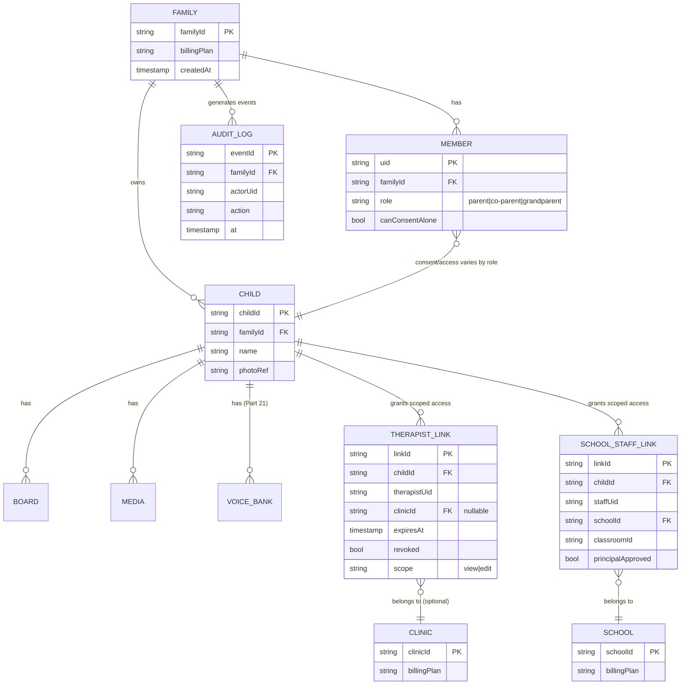

# 03 — Privacy, Security & Family Model (Parts 7, 8, 9, 20)

> Stage D output of the SaaS transformation plan (see `COBOARD_TASK.md`, Parts 7/8/9/20).
> Date: 2026-07-07 · Authors: Security Sentinel (Sonnet, persistent) + Architect.
> Source of truth: code (`docs/firestore.rules`, `firebase/storage.rules`, `functions/src/*.ts`,
> `app/src/services/sync/`, `app/src/data/keyStore.ts`, `app/src/domain/access*.ts`, `firebase.json`,
> `.github/workflows/*`) cross-checked against `docs/00-discovery.md` and `docs/reviews/HANDOFF.md`.
> Every claim about rule/code behavior below is backed by a quoted snippet or an exact file:line
> reference. Items without direct code evidence are marked **[Assumption]** or **[TBD]**.

---

## Part 7 – Security Assessment

### 7.1 Authentication

**Current implementation** (`app/src/services/sync/firebaseProvider.ts`, `functions/src/approveUser.ts`):
- Firebase Auth email/password (`signInWithEmailAndPassword` / `createUserWithEmailAndPassword`) + Google sign-in popup.
- Password storage/hashing is fully delegated to Firebase Auth (scrypt-based, Google-managed) — Co_Board never sees or stores a password hash. No custom Argon2id/bcrypt code exists or is needed.
- Two-stage gate before a user can touch any data: (1) `email_verified` on the Firebase ID token, (2) an `approved` custom claim set only by the `approveUser` Cloud Function after manual admin review. Enforced both server-side (rules `isApproved()`) and Cloud Function-side (`ttsProxy.ts:44`, `aiBoard.ts:55`).
- Session handling: standard Firebase SDK — 1h ID token, silent refresh via refresh token stored by the SDK. No custom JWT rotation logic (not needed; Firebase manages this correctly out of the box).

**Gaps / recommendations:**
- **No MFA.** Firebase Auth supports TOTP and phone-based MFA natively; none is wired up in `firebaseProvider.ts` or `firebaseAuth.ts`. For therapist and school-staff accounts — which can reach multiple children's data via `childAccess` — this is a real gap given the sensitivity of the data. Recommend: enforce TOTP MFA for any account holding a `clinician`/`staff` role in `childAccess`, optional-but-encouraged for parents.
- **Password policy** is whatever Firebase project defaults to (currently min 6 chars unless tightened in Console) — **[TBD]** confirm/raise minimum length + breached-password check (Firebase Identity Platform "password policy enforcement" — requires upgrading from legacy Auth to Identity Platform, **[Assumption]** not yet done).
- **Account recovery vs. "child locked out of voice":** Because Co_Board is offline-first with IndexedDB as the source of truth (`docs/00-discovery.md` §2), a child's board/voice keeps working locally even if the parent's cloud account is locked out — verified: the child-lock/PIN gate (`app/src/domain/access.ts`) is pure local logic (`verifyPin`, `DEFAULT_PIN`) with **no dependency on Firebase Auth state**. This is a correct design for the AAC "never lose your voice" invariant. Risk is confined to *sync* (new devices, cloud backup) being unavailable during recovery, not to on-device communication.
- **Child accounts are not Auth users.** Children have no email/password/Firebase UID; they exist only as `users/{uid}/children/{childId}` documents owned by a parent's account (`docs/firestore.rules:57-62`). Pros: avoids COPPA's "verifiable parental consent for a child's own account" problem entirely — there is no child account to consent to. Cons: (a) no way to scope a session/audit trail to "this device was in child mode" vs. "adult mode" beyond the local PIN gate; (b) if a family has one shared parent login used by multiple caregivers, there is no per-caregiver identity for audit purposes (see Part 20 — Co-Parent role addresses this at the *account* level, but the PIN gate does not currently authenticate *which* adult unlocked the device).

### 7.2 Authorization

**Current role model in code:**
- `functions/src/acceptInvite.ts:20,28`: `role: 'parent' | 'clinician' | 'staff'`, validated server-side against `ALLOWED_ROLES` before being written to `childAccess/{childId}/members/{uid}`.
- **The role is stored but not used for differentiated authorization anywhere in the rules or Cloud Functions inspected.** `docs/firestore.rules:60-61` grants full `read, write` on `users/{uid}/children/{childId}` to *any* uid with a `childAccess` membership document, regardless of role value:
  ```
  match /users/{uid}/children/{childId} {
    allow read, write: if isApproved()
      && (isOwnUid(uid) || hasChildAccess(childId));
  }
  ```
  A `staff` or `clinician` member has exactly the same read/write power as the owning `parent`. This is a real gap against the target model (Part 20: Parent/Child/Co-Parent/Therapist/School Staff/Admin need different capabilities).

**Target model (Part 20 §Permission matrix) vs. today:**
| Capability | Today | Target |
|---|---|---|
| View board | any `childAccess` member | all roles |
| Edit board | any `childAccess` member (full write) | Parent/Co-Parent/Therapist(scoped) only |
| Clone board | any `childAccess` member | role-gated |
| Delete child / erase data | any `childAccess` member (!) | Parent/Co-Parent + dual-consent only |
| Membership expiry | none — grant is permanent until manually revoked | time-bound links (therapist/school) |
| Audit log of access/edits | none | required |

- **Board sharing granularity:** invite → `childAccess` member is currently binary (full read/write or nothing). There is no view-only, no clone-only, no per-board (vs. per-child) scope.
- **No expiry on membership.** `acceptInvite.ts:76-81` writes `childAccess/{childId}/members/{uid}` with no `expiresAt`; a therapist who finishes an engagement retains full access forever unless the owner manually deletes the membership doc (and the current rules give the owner, and only the owner, write access to `childAccess` — `ownsChildDoc(childId)` at `docs/firestore.rules:71-73` — so revocation is *possible* today, just not automatic/time-bound, and not audited).
- **No audit log.** No collection records who accessed/edited what; grants themselves have `grantedAt` but reads are not logged anywhere (Firestore's built-in audit logging is a paid GCP feature not confirmed enabled — **[TBD]**).

**Tenant isolation / IDOR resistance — rule-by-rule:**
- `users/{uid}` — read gated by `isOwnUid(uid) || isAdmin()` (`docs/firestore.rules:39`); `list` gated by `isAdmin()` only (`:90`) — prevents enumeration of the users collection by non-admins. Good.
- `users/{uid}/{collection}/{document}` (boards, profiles, settings, etc.) — `allow read, write: if isOwnUid(uid) && isApproved()` (`:52-54`). No cross-uid path exists here; Firestore's most-specific-match semantics mean the sibling `.../children/{childId}` rule below overrides this wildcard specifically for the children subcollection.
- `users/{uid}/children/{childId}` — gated by ownership or `hasChildAccess(childId)`, which checks `exists(childAccess/{childId}/members/{request.auth.uid})` (`:24-27`). Membership documents are writable only by `ownsChildDoc(childId)` (the true owner) or via the `acceptInvite` Cloud Function running under the Admin SDK (which bypasses rules but enforces its own transactional invite-code validation). **No path allows a non-owner, non-invited uid to create their own `childAccess` membership** — privilege escalation is blocked (documented in-code as "B4").
- `shareInvites/{code}` — `read` restricted to `resource.data.ownerUid == request.auth.uid` (`:79-80`); the invitee **never reads the invite document directly** — redemption goes exclusively through `acceptInvite` (Admin SDK). Invite codes are 128-bit random hex (`app/src/data/childRepo.ts:154-157`, `crypto.getRandomValues(16 bytes)`), 48h TTL, single-use (transactional `used` flag in `acceptInvite.ts:51-91`) — not guessable, not enumerable via rules.
- **Conclusion for cross-tenant access via rules: no direct path found.** The only ways to gain access to another family's `childId` are (a) being granted via a redeemed invite code (128-bit, expiring, single-use, server-validated) or (b) a bug in `hasChildAccess`/`ownsChildDoc` logic. See Part 9 for the full walk-through and recommended negative tests.
- **Cloud Function authz:** `approveUser.ts:23` checks `request.auth.token['admin']`; `ttsProxy.ts:44` / `aiBoard.ts:55` check `request.auth.token['approved']`; `acceptInvite.ts:36-38` only requires *any* signed-in user (correct — invite acceptance is meant to be available to a newly-invited, possibly-not-yet-approved clinician; **[Assumption]** intended, but note this means an unapproved user can join `childAccess` and thus read child data before an admin has approved them, since `hasChildAccess` doesn't check `isApproved()`— wait, `users/{uid}/children/{childId}` read still requires `isApproved()` per `:60`, so the unapproved invitee can hold a `childAccess` grant but cannot yet read the child doc until admin-approved. This is consistent, but worth confirming as intended sequencing.)

### 7.3 API Security

All four Cloud Functions (`ttsProxy`, `aiBoard`, `approveUser`, `acceptInvite`) are Firebase `onCall` functions (not raw HTTP), which gives them built-in CSRF immunity (no cookies; the SDK sends a Firebase ID token as a bearer credential in the request body/headers, not automatically attached like a cookie) and built-in JSON parsing (no manual body parsing injection surface).

| Function | Input validation | Rate limit | Abuse-cost vector | Notes |
|---|---|---|---|---|
| `ttsProxy` | `text` type+trim check, `MAX_TEXT_LEN=400` (`ttsProxy.ts:28,52-53`), `voiceId` whitelist (`ALLOWED_VOICES`, `:22-27,55-56`), rate/pitch clamped (`:62-63,104-106`) | 120 calls/min/uid (`:60`, via `enforceRateLimit`) | Google Cloud TTS is billed per character; 400-char cap × 120/min/uid bounds worst-case spend per abusive account | 15s upstream timeout (`:73`), 20s function timeout |
| `aiBoard` | `topic` type+trim+`MAX_TOPIC_LEN=300` (`:68-72`), `count` clamped to `[1,64]` (`:69,73`) | 30 calls/min/uid (`:61`) | Gemini billed per token; `maxOutputTokens: 8192` capped server-side (`:96`) bounds worst-case per call | `action: 'edit'` explicitly unimplemented, returns `unimplemented` (`:64-66`) — no partial/unsafe code path |
| `approveUser` | `uid`/`status` enum check (`:29`) | none (admin-only, low volume) | admin-gated, not user-abusable | merges custom claims rather than overwriting (`:36-39`) — avoids accidentally clearing `admin` claim |
| `acceptInvite` | `code` type check (`:42-44`) | **none** | 128-bit code space makes brute force infeasible even without rate limiting, but each call still costs a Firestore transaction (2 reads + 2 writes) | Recommend adding a light rate limit anyway (defense-in-depth against cost-based DoS, not confidentiality) |

**Injection/XSS:** React's JSX auto-escaping is the primary control; no `dangerouslySetInnerHTML` usage found during this review pass (not exhaustively re-grepped this cycle — **[Assumption]** consistent with prior Ultra Review findings in HANDOFF). CSP (`firebase.json`) provides defense-in-depth (see 7.5).

**CSRF:** Not applicable in the traditional sense — no server-rendered session cookies; all cloud writes are either Firestore SDK calls authenticated by Firebase ID token (not a cookie) or `onCall` functions with the same token-based auth. `[N/A]`.

**SSRF:** All server-side `fetch()` calls in `functions/src/` target **hardcoded** URLs (`GOOGLE_TTS_URL` in `ttsProxy.ts:18`, `GEMINI_URL` in `aiBoard.ts:18-19`) — no user-supplied URL is ever passed to a server-side `fetch`. No SSRF surface found.

**File upload validation:** `firebase/storage.rules:21-24`:
```
function isValidMedia() {
  return request.resource.size <= 10 * 1024 * 1024
    && request.resource.contentType == 'application/octet-stream';
}
```
Trade-off explicitly by design: media is client-side AES-GCM encrypted (`app/src/services/sync/crypto.ts`) *before* upload, so the object Storage receives is ciphertext with no meaningful MIME type — Storage cannot MIME-sniff or malware-scan the plaintext. This is a **structural blind spot**: a malicious actor who compromises a device (or the encryption path) could upload arbitrary encrypted bytes and Storage has no way to validate they decode to a valid image. Mitigations to propose:
1. Client-side validation *before* encryption: verify magic bytes/dimensions of the plaintext image, cap dimensions, re-encode via `<canvas>` (already partially done for WebP compression per `docs/00-discovery.md` §2) to normalize/strip any embedded payload.
2. Size cap already present (10MB) bounds worst case.
3. Because content is E2E-encrypted, **server-side malware/NSFW scanning is not possible today** — this is an explicit, documented trade-off (privacy-by-design vs. content-safety scanning). Future approach: client-side NSFW/quality check pre-encryption (on-device model or a scan-then-encrypt flow with explicit non-retention of the plaintext), so no plaintext ever reaches the server. Track as an open design question for Part 21 (voice/photo features) — do not silently ship photo upload without addressing this.

### 7.4 Secrets

Confirmed from source: `GOOGLE_TTS_API_KEY` and `GEMINI_API_KEY` are declared via `defineSecret(...)` (Firebase Functions v2 params, backed by Google Secret Manager) in `ttsProxy.ts:19` and `aiBoard.ts:13` — never hardcoded, never shipped in the client bundle. `functions/src/index.ts` only exports the four functions; no secret material passes through it. Client Firebase config (`VITE_FIREBASE_*`) is public-by-design (API key is not a secret in the Firebase model; access is enforced by Firestore/Storage rules, not by hiding the config) and is injected via GitHub Actions secrets at build time (`.github/workflows/deploy.yml:45-51`) — appropriate.

One residual code-hygiene item: `app/src/services/tts/googleTtsProvider.ts` is a **legacy client-side TTS provider** that takes a raw `apiKey` constructor argument and calls Google TTS directly from the browser (`x-goog-api-key` header sent client-side, `googleTtsProvider.ts:19,34`). It is confirmed **unused in production** (superseded by `functionsTtsProvider.ts` which calls the `ttsProxy` Cloud Function — see `app/src/services/tts/ttsWiring.ts` comments and `app/src/data/settingsRepo.ts:10` "מפתח Google TTS *הוסר* מ-IDB"). Dead code, but a latent risk: if ever re-wired with a live key (e.g., by a future contributor unaware of the `ttsProxy` migration), it would leak the Google TTS key into every client bundle. Recommend deleting the file or gating it behind a loud dev-only comment/lint rule.

**Mobile-future note:** when native iOS/Android builds ship (Part 18), the same rule applies with higher stakes — API keys must never be embedded in the compiled binary (reverse-engineerable via `strings`/decompilation). All third-party AI/TTS calls must continue to route through the existing Cloud Function proxies; do not add a native "convenience" direct-to-provider path.

### 7.5 Infrastructure

- **CSP** (`firebase.json:20-22`): strong base (`default-src 'self'`, `object-src 'none'`, `frame-ancestors 'none'`, explicit allow-lists for Google/Firebase/ARASAAC/Dicta/accounts.google.com) but **`script-src` and `style-src` both include `'unsafe-inline'`**, which materially weakens XSS defense-in-depth (an injected `<script>` tag or inline event handler would still execute). HANDOFF (§7 table, "3.7") confirms this is a known, deferred spike. **Fix plan:** move to nonce-based CSP (Vite can inject a per-build or per-request nonce via the hosting layer / a small edge function) or hash-based `'sha256-...'` allow-listing for the app's own inline styles/scripts if the set is static; Firebase Hosting static-file serving makes per-request nonces awkward (no server-side templating), so **hash-based CSP** is the more realistic path for a pure static SPA — complexity M, needs a build-time step to compute hashes of emitted inline `<style>`/`<script>` and inject them into `firebase.json` headers (or migrate remaining inline styles to CSS classes / external files where feasible, which is the cleaner fix and reduces the hash list's fragility).
- **App Check:** not enabled (confirmed absent from `functions/src/*.ts` and `firebase.json`; HANDOFF §3 open question "App Check — יש נכונות להפעיל reCAPTCHA Enterprise?"). This means `ttsProxy`/`aiBoard`/`acceptInvite`/`approveUser` accept calls from any client holding a valid Firebase ID token, including scripted/automated callers using a leaked or self-registered token — the per-uid rate limits are the only abuse throttle today. Recommend enabling App Check (reCAPTCHA Enterprise or the newer App Check with Play Integrity/App Attest for future native apps) before any paid-tier scale-up; classify as High given TTS/Gemini are billed per-use.
- **No WAF** — acceptable: Firebase Hosting is served through Google's global edge network (fronted by Google Front End infrastructure), which already provides DDoS absorption and basic request filtering; a dedicated WAF is not a near-term priority for a Hosting+Functions-only backend with no custom HTTP server. `[N/A for current architecture]`.
- **Firestore is in production mode** (default-deny with explicit allow rules, confirmed by rules structure — no permissive fallback match found) — correct posture, not "test mode."
- **HSTS** present with `preload` (`firebase.json:36-38`) — good, but confirm the domain is actually submitted to the HSTS preload list **[TBD]**, otherwise the header alone only protects repeat visitors.
- **Region:** primary `europe-west1` with `us-central1` kept live in parallel for backward compatibility (`functions/src/region.ts`) — reasonable transitional state, tracked for eventual removal once traffic monitoring confirms no more `us-central1` calls (HANDOFF §3, resolved-note).

### 7.6 Severity Table — Security Findings

| ID | Finding | Severity | Fix | Complexity |
|---|---|---|---|---|
| S-1 | No MFA for therapist/school-staff/parent accounts | High | Enable Firebase/Identity Platform TOTP MFA, enforce for `clinician`/`staff` roles | M |
| S-2 | `childAccess` role (`parent`/`clinician`/`staff`) not used for differentiated authorization — any member has full read/write | High | Add role-aware rule checks / Cloud Function-mediated writes for edit vs. view-only | M |
| S-3 | No expiry / time-bound membership for therapist/school-staff links | High | Add `expiresAt` to `childAccess` members + scheduled Cloud Function cleanup or rule-level expiry check | M |
| S-4 | No audit log of access grants or content edits | Medium | New `auditLog` collection (see Part 20) written by Cloud Functions on grant/revoke/edit | M |
| S-5 | CSP allows `unsafe-inline` for script/style | Medium | Migrate to hash-based CSP or eliminate inline styles/scripts | M |
| S-6 | App Check not enabled on any Cloud Function | High | Enable Firebase App Check (reCAPTCHA Enterprise) before scale-up | S–M |
| S-7 | Encrypted media upload cannot be server-side content-validated (MIME sniff / malware / NSFW scan) | Medium | Client-side pre-encryption validation + plan for on-device NSFW model | M–L |
| S-8 | `acceptInvite` has no rate limit (cost-DoS, not confidentiality — codes are 128-bit) | Low | Add `enforceRateLimit` per-uid/per-IP | S |
| S-9 | Legacy `googleTtsProvider.ts` with client-injectable API key left in codebase, unused but re-activatable | Low | Delete file or add loud deprecation guard/lint rule | S |
| S-10 | Single Firebase project for dev/staging/prod — rules/schema changes hit production directly | Medium | Add a staging Firebase project + promote via CI (also flagged in `docs/00-discovery.md` §7.2) | M |

No **Critical** findings in Part 7 — the existing baseline (server-held secrets, tested rate limits, tested rules, E2E media encryption, strict-by-default rules) is materially above "prototype" quality. The findings above are all realistic gaps for a commercial multi-tenant product, not active exploits found in this review.

---

## Part 8 – Privacy Assessment

### 8.1 Data inventory

| Data class | Where stored | Encryption | Retention | Lawful basis / consent needed |
|---|---|---|---|---|
| Child name, age, preferences (profile) | IndexedDB (device) + Firestore `users/{uid}/children/{childId}` (if sync opt-in) | Device: OS-level disk encryption only (not app-encrypted). Cloud: TLS in transit, Google-managed encryption at rest; **not** E2E encrypted (see 8.1a) | Until parent deletes/archives; archive ≠ erasure (8.3) | Parent consent (data of a minor/dependent) |
| Child photo (profile/media) | IndexedDB (device, `media` store) + Firebase Storage (if sync opt-in) | **Client-side AES-GCM, E2E, before upload** (`app/src/services/sync/crypto.ts`, `encryptBlob`) | Until deleted; soft-delete only locally (no confirmed hard-delete on Storage beyond `deleteMediaFromStorage`) | Parent consent; special category (photo of a minor with a disability) |
| Voice recordings (planned, Part 21) | Not yet implemented | **[TBD]** — must reuse the media E2E pipeline, not a new path | **[TBD]** | Explicit consent + (for cloning) dual-parent consent per COBOARD_TASK.md Part 21 |
| Board/tile content, usage events | IndexedDB (`boards`, `usage` stores) + Firestore (boards only, if sync opt-in) | Boards: plaintext in Firestore (not E2E, see 8.1a). Usage/analytics: **local-only, opt-in**, not synced to cloud (confirmed: no analytics collection found in Firestore schema per `docs/00-discovery.md` §4.1) | Local until pruned; no cloud retention because not synced | Parent consent (implicit, product use); usage data can reveal therapy-relevant behavioral patterns — treat as sensitive |
| TTS utterance text | Transient — sent to Google Cloud TTS via `ttsProxy` Cloud Function, not stored server-side by Co_Board | N/A (in-transit TLS only; leaves Co_Board's control) | Google's own retention policy applies — **[TBD]**, no DPA confirmed | **Flagged in code**: `ttsProxy.ts:7` "TODO(אבטחה/רגולציה): לאמת דרישת COPPA/GDPR/חוק-הגנת-הפרטיות מול היועמ"ץ לפני ייצור" — unresolved pre-production legal gate |
| Nikud (vowelization) text | Sent to Dicta Nakdan API (`app/src/services/nikud/nakdanClient.ts:8`, `nakdan-2-0.loadbalancer.dicta.org.il`) | In-transit TLS only | Dicta's retention policy — **[TBD]**, licensing itself unresolved (ADR-0005) | Same category as TTS text — words a nonverbal child is trying to say |
| AI board topics | Sent to Gemini Flash via `aiBoard` Cloud Function (`functions/src/aiBoard.ts:19`) | In-transit TLS only | Google's Gemini API data-use terms — **[TBD]**, verify whether prompts are used for model training (Gemini API vs. consumer Gemini has different defaults) | Topic text is user-chosen but could reveal a child's interests/therapy goals |
| Symbol search queries | Sent to ARASAAC API (`app/src/services/symbols/arasaacClient.ts:1,14`) | In-transit TLS only | ARASAAC's own retention — low risk (CC-licensed public symbol library; queries are generic words, not PII) | Low risk, minimal — search terms rarely PII on their own |
| Auth credentials | Firebase Auth (Google-managed) | Google-managed (scrypt hash, not visible to Co_Board) | Google Auth lifecycle | Standard account creation consent |

**8.1a — Important nuance on "encryption at rest":** `docs/00-discovery.md` correctly scopes the E2E-encryption claim to *media* ("Storage limited to encrypted blobs ≤10MB", "media E2E-encrypted (AES-GCM) client-side before upload"). This review confirms that scoping precisely: `app/src/services/sync/crypto.ts` exports both `encryptData`/`decryptData` (generic JSON encryption) and `encryptBlob`/`decryptBlob` (media). **A repo-wide search found `encryptData`/`decryptData` used only in their own unit tests (`crypto.test.ts`, `crypto.failLoud.test.ts`) — they are not called anywhere in `firebaseProvider.ts` or `syncEngine.ts`.** `firebaseProvider.push()` (`app/src/services/sync/firebaseProvider.ts:60-64`) writes `r.versioned` (the raw board/profile object) directly to Firestore with `setDoc`, unencrypted. So: **child name, board vocabulary, and profile preferences are plaintext in Firestore**, protected only by TLS-in-transit, Google's server-side (not per-tenant) encryption-at-rest, and Firestore security rules — not E2E. This is a defensible product trade-off (Firestore needs to read structured fields like `updatedAt` for querying/sync; E2E-encrypting board JSON would break server-side query filtering) but the PRD/marketing language must not overclaim "all data end-to-end encrypted" — only media currently is. Flagged as **finding D-01**.

**8.1b — Media E2E key-sharing gap (new finding, not previously documented):** The media encryption key (`app/src/data/keyStore.ts`) is a **non-extractable, device-bound** `CryptoKey` — generated once per device, stored in IndexedDB, and by design (`USAGES` includes `wrapKey`/`unwrapKey` for the per-file CEK envelope) can never be exported off that device. `mediaSync.ts` encrypts each photo with a random per-file key wrapped by this device key (`crypto.ts:98-132`, format `CB02`). **There is no key-exchange mechanism found anywhere in the codebase** to give a second device (the same parent's tablet) or a different family member (a therapist granted `childAccess`) the ability to decrypt a photo encrypted on the original device. Storage rules (`hasChildAccess`) would *let* a therapist's device download the encrypted blob, but that device holds a different, unrelated device key and **cannot decrypt it** — `decryptBlob` will fail closed and return `null`. Net effect: this fails safely (no accidental plaintext leak to an unintended device) but silently breaks the product's own "share a board with a therapist" feature for photos, and breaks multi-device use for a single parent (second phone/tablet). This needs an explicit design decision (see Part 20 recommendation: envelope the device key itself under a family/child-scoped key distributed via `acceptInvite`, or move to a server-brokered wrapped-key model) — flagged as **finding D-02 / Critical for product correctness, not confidentiality**.

### 8.2 Third-party data flows — exactly what leaves the device

| Flow | Trigger | Data sent | Toggle | Risk | Mitigation |
|---|---|---|---|---|---|
| Firestore/Storage sync | Sync opt-in setting | Board/profile JSON (plaintext) + encrypted media blobs | User-controlled, off by default per `docs/00-discovery.md` (**[Assumption]**, confirm default state in settings UI) | Cloud provider (Google) access to plaintext board/profile data | DPA with Google Cloud (standard Firebase ToS may already cover this — **[TBD]** confirm a signed/accepted DPA exists for this Firebase project) |
| TTS online path | Any tile tap when online + TTS provider = Google | Full utterance text (child's spoken output, ≤400 chars) | Falls back automatically; user can force browser `speechSynthesis` (fully local) — **[TBD]** confirm a user-facing toggle exists to force offline-only TTS | Utterance content of a nonverbal/speech-delayed child sent to Google | Region pinning already done (`europe-west1`, chosen "בעקבות מיצוב הפרטיות" per `ttsProxy.ts:6`); still needs the explicit legal review flagged in-code before production; consider text minimization (no metadata beyond the utterance itself — confirmed, `ttsProxy.ts` body only sends `text`+`voice`+`audioConfig`, no uid/child metadata) |
| Nikud (Dicta Nakdan) | Any text needing vowelization when online | Word/phrase text | **[TBD]** confirm toggle; discovery.md notes "gated by `VITE_NAKDAN_ENDPOINT`" (env-level, not user-level) | Same category as TTS; also unresolved commercial licensing (ADR-0005) blocks production use as-is | Resolve licensing before GA; treat as EU-only endpoint if possible; minimize to word-level batches, not full sentences with context |
| ARASAAC symbol search | Board builder symbol search | Search keyword (Hebrew/English word) | Always-on when online (falls back to 90-day offline cache, `docs/00-discovery.md` §2) | Low — generic vocabulary, CC-licensed public API, no child identifiers sent | Already using CacheFirst to minimize repeat calls |
| Gemini (`aiBoard`) | AI board-generation feature, opt-in action | `topic` string (≤300 chars, user-typed) | User-initiated per generation; gated to `approved` users only | Topic could reveal therapy goals/interests of the child (e.g., "אוכל שהילד שלי אוהב") | Verify Gemini API (not consumer product) data-use terms exclude training on prompts; document in privacy policy; consider a warning to parents before first use |

**No flow found that sends child photos/voice/diagnosis text to any AI provider today** — only text prompts (TTS utterance, nikud text, AI-topic) and encrypted media (Google Storage only, ciphertext). This is a meaningfully better posture than the worst case for an AAC product, but every one of the plaintext-to-third-party flows above needs a completed DPA/legal review before General Availability, consistent with the in-code TODO.

### 8.3 Data minimization, erasure, portability, access logs

- **Data minimization:** generally good — TTS/AI calls send only the minimum text needed, not device/child metadata (verified in `ttsProxy.ts`/`aiBoard.ts` request bodies). Symbol search sends only the query term.
- **Right to erasure:** **Gap.** "Archive" (`profileSync.ts:22`, `archivedAt`) is a soft-delete flag, not deletion — archived profiles/boards remain in IndexedDB and in Firestore/Storage indefinitely. **No cloud account-deletion Cloud Function exists** (confirmed: no `deleteUser`/erasure logic found in `functions/src/`). A parent who wants their child's data permanently removed from Google's infrastructure currently has no self-service path; this must exist before any GDPR-exposed or Amendment-13-exposed launch. Recommend: an `eraseAccount` Cloud Function (Admin SDK) that (a) deletes all `users/{uid}/**` documents, (b) deletes all `childAccess/{childId}/members/*` where the child is solely owned by this uid, (c) deletes all Storage objects under the child's `profiles/{profileId}/media/**` prefix, (d) deletes the Firebase Auth user, (e) writes a tombstone/erasure-audit record (retained separately, minimal metadata only) for compliance proof.
- **Portability:** partially covered — OBF (Open Board Format) export exists (`app/src/services/obf/obfService.ts`, confirmed in discovery.md as "OBF import/export ✓"). This covers board/tile structure but **not** media/photo export or usage-history export — full portability (Art. 20 GDPR-equivalent) needs those extended.
- **Access logs:** **Gap.** No logging of who read/downloaded a child's data (which `childAccess` member pulled which board, when). Needed both for compliance (תקנות אבטחת מידע, "תיעוד אירועים" — see 8.4) and for the AAC-specific abuse case of a revoked therapist or an ex-spouse accessing data (Threat Model, below).

### 8.4 Consent flows

Design requirements (not yet implemented — **[TBD]** confirm current UI has *any* explicit consent screen beyond ToS/signup):
- **Parent-for-child consent:** since children have no account of their own (7.1), the parent's account creation *is* the consent point today. Recommend an explicit, logged consent step ("I am the legal guardian of the child whose data I am about to enter") at first child-profile creation, not just at generic signup.
- **Dual-parent consent for sensitive operations:** not implemented. Needed for: voice cloning (Part 21, explicitly required by task spec), permanent deletion of a child's data, and possibly granting a new therapist/school-staff link. Requires the family model in Part 20 to exist first (need a second "co-parent" identity to get consent *from*).
- **Divorced-family scenarios:** no design exists today — the current model has one owning `uid` per child with no concept of two legally-separate guardians who may disagree. This is a named threat in COBOARD_TASK.md Part 20/26 ("ex-spouse accessing child data") — see Threat Model and Part 20 design below.

### 8.5 Compliance mapping

| Regime | Applicability | Obligations (concrete) | Status |
|---|---|---|---|
| **חוק הגנת הפרטיות (Israel) + תקנות אבטחת מידע, 2017** | Applies now — Israeli company processing data of Israeli minors | Classify database security level: given "sensitive data of minors + disability status," this almost certainly qualifies as **רמת אבטחה גבוהה** (high security level) per the regulation's sensitive-data criteria (health/disability-adjacent data, minors). Obligations at that tier: (1) **רישום מאגר** (database registration with רשם מאגרי מידע) — not found in repo, **[TBD]** legal action item; (2) **ממונה אבטחת מידע** (designated security officer) — **[TBD]**, no role/doc found; (3) **נוהל אבטחה** (written security procedure document) — not found in `/docs`; (4) **ביקורת תקופתית** (periodic security audit, required more frequently at high tier) — this document is a first step but not a recurring program; (5) **הצפנה** — partially satisfied (media E2E; board/profile data is not, see 8.1a); (6) **בקרת גישה** — satisfied at the technical level (Firestore/Storage rules), needs an organizational access-control policy document; (7) **תיעוד אירועי אבטחה** (security incident logging) — gap, no access/incident log exists (8.3). | Largely unmet at the paperwork/process level; technical controls are ahead of the compliance documentation |
| **תיקון 13 לחוק הגנת הפרטיות** (Amendment 13, effective Aug 2025) | Applies — introduces DPO (**ממונה הגנת פרטיות**) mandatory-appointment thresholds and expanded enforcement powers for the Privacy Protection Authority | Determine whether Co_Board crosses the DPO-mandatory threshold (tied to processing volume / sensitive-data processing as a core activity — processing children's disability-related data as the core business likely qualifies regardless of headcount) — **[TBD — legal review required]** | Not assessed; flag as a pre-launch legal action item |
| **GDPR** (EU expansion posture) | Not yet applicable (Israel-only user base **[Assumption]**) but architecturally anticipated — `europe-west1` region choice is explicitly justified in-code by privacy positioning (`ttsProxy.ts:6`) | If/when EU users are onboarded: Art. 8 (child consent age varies 13-16 by member state), Art. 17 (erasure — currently a gap, 8.3), Art. 20 (portability — partial), Art. 35 (DPIA — see 8.6), SCCs/DPA for any US-based sub-processor (Google Cloud TTS/Gemini are Google Cloud, which offers EU data-processing terms — **[TBD]** confirm actually signed for this project) | Good regional posture, no formal EU compliance program yet |
| **COPPA** (US posture) | Not directly applicable today (Israel-only) but relevant if the product ever ships to US families/schools | COPPA requires verifiable parental consent for collecting data from children under 13 *directly*. Because children have no account and never directly interact with any data-collection consent flow (parents create/manage everything), Co_Board's "child has no account" design is COPPA-friendly by construction — but COPPA also cares about *indirect* collection (photos/voice of the child stored by the service) — the parent-consent flow (8.4) would need to be COPPA-formalized (specific required disclosures) before any US launch. | Favorable architecture, no formal compliance program |
| **HIPAA** (US posture, if US therapists) | Not applicable today (no US therapist customers **[Assumption]**); posture-only note per task scope | If therapy notes/diagnoses become a stored data type (not currently — only board content and usage patterns are stored, no clinical notes field found in the schema), Co_Board would need to evaluate whether it becomes a Business Associate under HIPAA. Today's data (AAC boards, usage events) is arguably *not* PHI, but disability status inferable from board content is a gray area. | Out of scope for current data model; revisit if a "therapy notes" feature is added |

### 8.6 DPIA (Data Protection Impact Assessment) — initial

**1. Processing description:** Co_Board (parent/guardian-operated PWA) processes: child's name, age, photo(s), AAC board content/vocabulary usage, and (planned) voice recordings, on behalf of families of children with speech/communication disabilities, for the purpose of enabling augmentative communication. Optional cloud sync extends processing to Google Cloud (Firestore/Storage/Cloud Functions, `europe-west1`) and, for TTS/nikud/AI features, to Google Cloud TTS, Dicta Nakdan, ARASAAC, and Gemini Flash as sub-processors of specific text fields.

**2. Necessity & proportionality:** Photo/board data is core to the product's function (a communication board is, by definition, personalized to the individual). Usage analytics are opt-in and local-only (not sent to any server), which is a proportionate design. TTS/nikud text transmission is necessary for the hybrid online voice quality feature but has a fully local fallback (`speechSynthesis`), meaning the *sensitive* transmission is avoidable by the user — this should be made an explicit, prominent opt-out, not just a technical fallback.

**3. Risks to data subjects:**
| Risk | Likelihood | Severity | Notes |
|---|---|---|---|
| Cloud misconfiguration exposes another family's child data (cross-tenant leak) | Low (rules reviewed in Part 9, no path found) | Critical if it occurred | Mitigate via rules test suite expansion (Part 9) |
| Third-party AI/TTS provider retains/trains on utterance text revealing a nonverbal child's private communications | Medium (unconfirmed data-use terms) | High | Legal review of Google TTS/Gemini/Dicta terms — **[TBD]**, blocks production per existing in-code TODO |
| Photo of a child with a visible disability leaked (device theft, sync misconfiguration) | Low-Medium (device loss is plausible; sync is E2E-encrypted) | High | E2E media encryption mitigates cloud-side exposure; device-level risk remains (no app-level lock beyond the PIN gate, which is not a cryptographic control per `access.ts:5`) |
| Revoked therapist retains access after engagement ends | Medium (no expiry mechanism exists, S-3) | High | See Part 9/20 remediation |
| Ex-spouse/non-custodial parent accesses child data without consent | Medium (no dual-consent/custody model exists) | High | See Part 20 design + Threat Model |
| Voice-clone misuse (impersonation of a family member's voice) | Low today (feature not built) | Critical if built without safeguards | Must not ship without the consent/identity-verification gates in Part 21's own spec |

**4. Mitigations:** see Section 8.7 remediation table and Part 9/20 designs below.

**5. Residual risk:** Medium overall — technical controls (encryption, rules, rate limits) are solid; organizational/process controls (DPO, incident logging, erasure flow, dual-consent, therapist expiry) are the dominant residual risk today.

**6. Sign-off:** **[TBD]** — requires product owner + legal counsel sign-off before production launch with real family data at scale; this document is an input to that decision, not a substitute for it.

### 8.7 Privacy Remediation Plan

| Priority | Action | Owner |
|---|---|---|
| P0 | Legal review of TTS/nikud/Gemini data-use terms (in-code TODO, `ttsProxy.ts:7`) | Legal/Architect |
| P0 | Build `eraseAccount` Cloud Function (right to erasure) | Analyst/Architect |
| P0 | Resolve Nakdan licensing (ADR-0005) before relying on it in production | Product owner |
| P1 | Access/audit log collection (Part 20 schema) | Architect |
| P1 | Time-bound `childAccess` grants + revocation on expiry | Architect |
| P1 | Dual-parent consent flow for sensitive actions | UX + Architect |
| P1 | Fix media E2E key-sharing gap (D-02) so therapist/second-device sharing actually works | Architect |
| P2 | רישום מאגר מידע + ממונה אבטחה + נוהל אבטחה documentation (Israeli compliance paperwork) | Product owner/Legal |
| P2 | Extend OBF export to include media/voice for full portability | Analyst |
| P2 | DPO threshold assessment under Amendment 13 | Legal |

---

## Part 9 – Multi-Tenant Assessment

### Core question: Can one tenant access another tenant's data?

**Answer: No direct path was found in the current rules/Cloud Function code**, under the current tenant model (each family = one owning `uid`; no clinic/school tenant concept exists yet). Reasoning, walked through line-by-line:

1. **Guessing/enumerating another family's `childId`:** even if a `childId` were guessed, `users/{uid}/children/{childId}` requires either `isOwnUid(uid)` (the guesser is not the owner) or `hasChildAccess(childId)` — which requires a `childAccess/{childId}/members/{attackerUid}` document to *already exist*. Guessing the `childId` alone grants nothing.
2. **Creating your own `childAccess` membership:** blocked. `childAccess/{childId}/members/{memberId}` write requires `ownsChildDoc(childId)` (`docs/firestore.rules:71-73`), i.e., the writer must already own `users/{writerUid}/children/{childId}` — an attacker who doesn't own the child cannot self-grant access. The only other write path is the `acceptInvite` Cloud Function, gated by a 128-bit, expiring, single-use invite code that only the true owner can generate and that the invitee can never read directly from Firestore (`shareInvites` read is owner-only, `:79-80`).
3. **`shareInvites` code guessing:** 128-bit random hex space (`generateShareCode()`, `app/src/data/childRepo.ts:154-157`) makes brute-force infeasible (2^128 space; even at an unrealistic 10M guesses/sec, exhaustion is meaningless within the 48h TTL). No rate limit exists on `acceptInvite` (S-8) but this is a cost concern, not a confidentiality one at this entropy.
4. **`users` collection enumeration:** `list` is admin-only (`:90`); individual `get` is owner/admin-only (`:39`) — a non-admin cannot enumerate other users' UIDs via Firestore queries.
5. **Storage path guessing:** `firebase/storage.rules` gates every read/write on the same `hasChildAccess` Firestore check via `firestore.exists(...)` cross-service rule (`storage.rules:13-18`) — same protection as above, and object paths (`profiles/{profileId}/media/{mediaId}`) use the same `childId`/`profileId` that is already protected.

**No clinic/school tenant concept exists today** — the data model is strictly family-scoped (one owning `uid` per child, `childAccess` grants layered on top). This is the primary gap against the Part 9 scenario ("5,000 independent families + 500 clinics + 50 schools", "a therapist working with 20 families"): today, a therapist working with 20 families needs 20 separate invite-code redemptions and ends up with 20 independent `childAccess` grants under their one `uid` — which *does* correctly isolate each family's data from every other (each grant is scoped to exactly one `childId`), but provides no clinic-level administration (a clinic admin cannot see/manage which of their therapists has access to which children; no clinic billing entity; no bulk-revoke when a therapist leaves the clinic).

### Design target: tenant entities

Introduce three tenant-adjacent entities without breaking the existing per-child isolation model (see Part 20 for full schema):
- **Family** (existing, implicit — formalize as `families/{familyId}` billing/ownership entity)
- **Clinic** (`clinics/{clinicId}`) — owns a roster of therapist `uid`s; a clinic admin can see/revoke all of a departed therapist's `childAccess` grants in bulk (requires a `clinicId` back-reference on each grant, or a Cloud-Function-mediated bulk-revoke keyed by `clinicId`+`uid`)
- **School** (`schools/{schoolId}`) — classroom-scoped, principal-approved staff links, analogous structure to Clinic

**Row-level guard pattern to add:** every `childAccess/{childId}/members/{uid}` document should carry an optional `grantedByOrg: { type: 'clinic'|'school', id: string }` field, so a clinic/school admin's bulk-revoke Cloud Function can query `collectionGroup('members').where('grantedByOrg.id', '==', clinicId)` (requires a Firestore collection-group index) and revoke in bulk — without ever giving the clinic admin direct read access to the child's actual board/profile data (separation of "who can administer the grant" from "who can read the content").

### Recommended negative tests to add to the rules test suite

The existing rules test suite (`functions/` under emulator, per HANDOFF §5 `npm run test:rules`) should be extended with these specific cross-tenant negative cases (8-10, as required by the task):

1. User A cannot `get` `users/{B}/children/{childId}` when no `childAccess` grant exists for A.
2. User A cannot `list` the `users` collection (non-admin).
3. User A cannot `create` a `childAccess/{childId}/members/{A}` document for a child A does not own (self-grant / privilege escalation attempt).
4. User A cannot `update` an existing `childAccess/{childId}/members/{B}` document belonging to a different member (only the owner may write).
5. User A cannot `read` `shareInvites/{code}` created by user B (owner-only read).
6. User A cannot `update` `shareInvites/{code}.used` directly from the client (only `acceptInvite` CF, via Admin SDK, should be able to — rules should reject any client-side update to this collection entirely, confirm no `allow update` rule exists for `shareInvites`).
7. User A cannot self-set `status: 'approved'` on their own `users/{A}` document (status-immutability test — likely already exists per HANDOFF §2 item 1, confirm coverage).
8. User A (non-admin) cannot set `admin: true`-gated behavior — i.e., cannot call `approveUser` semantics by direct Firestore write (rules should not expose any client-writable admin/approval field).
9. **Storage:** User A cannot `download` `profiles/{childId}/media/{mediaId}` for a child A has no `childAccess` grant for (cross-service rule test against the Storage emulator).
10. **Storage:** User A cannot `upload` to `profiles/{childId}/media/{mediaId}` for a child A has no grant for, even with a validly-sized/typed payload.

---

## Part 20 – Family & Multi-Role Account Model

### Entity model



### Permission matrix

| Action | Parent | Co-Parent | Child | Therapist (scoped, time-bound) | School Staff (classroom-scoped) | Clinic Admin | System Admin |
|---|:-:|:-:|:-:|:-:|:-:|:-:|:-:|
| View board | ✅ | ✅ | ✅ (local device use) | ✅ (assigned children only) | ✅ (assigned children only) | ❌ (no content access, admin-only) | ✅ (support, logged) |
| Edit board | ✅ | ✅ | ❌ | ✅ (if scope=edit) | ✅ (if scope=edit) | ❌ | ❌ (should not edit content) |
| Clone board | ✅ | ✅ | ❌ | ✅ | ✅ | ❌ | ❌ |
| Play mode | ✅ | ✅ | ✅ | ✅ | ✅ | ❌ | ❌ |
| Manage media (upload/delete photo) | ✅ | ✅ | ❌ | ⚠️ upload only, no delete | ⚠️ upload only, no delete | ❌ | ❌ |
| Record voice (Part 21) | ✅ | ✅ | ❌ | ❌ | ❌ | ❌ | ❌ |
| Approve voice-clone (dual-consent action) | ✅ **+ 2nd parent required** | ✅ **+ 1st parent required** | ❌ | ❌ | ❌ | ❌ | ❌ |
| Delete child data (erasure) | ✅ **+ 2nd parent required if co-parent exists** | ✅ **+ 1st parent required** | ❌ | ❌ | ❌ | ❌ | ⚠️ emergency/legal-order only, logged |
| Invite therapist | ✅ | ✅ | ❌ | ❌ | ❌ | ✅ (assign clinic therapist to a family that engaged the clinic) | ❌ |
| Revoke therapist/staff link | ✅ | ✅ | ❌ | ❌ (cannot revoke own access) | ❌ | ✅ (bulk, for departed staff) | ✅ |
| Billing | ✅ (family plan owner) | ⚠️ view-only unless co-owner | ❌ | ❌ | ❌ | ✅ (clinic plan) | ✅ |
| Export data (portability) | ✅ | ✅ | ❌ | ❌ | ❌ | ❌ | ❌ |
| View analytics/usage | ✅ | ✅ | ❌ | ✅ (assigned children, aggregate/therapy-relevant only) | ⚠️ limited (classroom aggregate, no individual detail without parent opt-in) | ❌ | ❌ |

**Dual-parent consent flags:** implement as a `pendingConsent` sub-document on the sensitive action (e.g., `families/{familyId}/consents/{consentId}` with `action`, `requestedBy`, `requiredApprovers: [uid]`, `approvals: [uid]`, `status`) — the sensitive action (voice-clone approval, permanent erasure) only executes once all `requiredApprovers` have approved, enforced by a Cloud Function, not by client-side rules alone (rules can check `approvals.length >= requiredApprovers.length` but the *execution* of the sensitive action should be Cloud-Function-mediated for auditability).

### Migration path from current schema

Current: `users/{uid}/children/{childId}` (owner-uid-centric) + `childAccess/{childId}/members/{uid}` (flat role grants, no expiry/scope/audit).

**Proposed target schema (backward-compatible, additive):**
```
families/{familyId}
  members/{uid}            # role: parent|co-parent|grandparent, canConsentAlone: bool
  children/{childId}        # MOVES here conceptually; keep users/{uid}/children/{childId}
                             # as a compatibility read-path during migration (see below)
childAccess/{childId}/members/{uid}   # ADD: expiresAt, scope ('view'|'edit'), grantedByOrg, revoked
therapistLinks/{linkId}     # NEW — supersedes generic childAccess for clinician role specifically
schoolStaffLinks/{linkId}   # NEW
clinics/{clinicId}
schools/{schoolId}
auditLog/{eventId}          # NEW — see schema below
consents/{consentId}        # NEW — dual-parent consent tracking
```

**Concrete migration steps:**
1. Add `familyId` field to existing `users/{uid}` documents via a one-time backfill Cloud Function: for every approved user with no `familyId`, create `families/{newFamilyId}` with that uid as the sole `parent` member, and stamp `familyId` on the user doc. Idempotent, additive — does not touch `children` data.
2. Extend `childAccess/{childId}/members/{uid}` writes (via `acceptInvite`) to always include `expiresAt` (default: e.g. 12 months for therapist role, renewable) and `scope` (default `'edit'` to preserve current behavior for existing/legacy invites — do not silently downgrade existing grants).
3. Update Firestore rules to check `scope` for write operations (view-only members get `allow read` but not `allow write`) — this is the only *breaking* rule change; ship behind a rules-emulator regression test pass first (Part 9's negative tests plus positive tests for each new scope value).
4. Introduce `auditLog` writes at every grant/revoke/sensitive-action Cloud Function — additive, no migration needed for existing data (log starts from deploy date forward; do not attempt to retroactively reconstruct history that was never logged).
5. Leave `users/{uid}/children/{childId}` as the canonical child document path (do not physically move child documents into `families/{familyId}/children/{childId}` — that would require rewriting every board/media reference). Instead, `families/{familyId}` becomes a *billing and membership* entity that references existing `(ownerUid, childId)` pairs; this avoids a risky data-migration of the entire board/media graph.
6. Roll out dual-parent consent (`consents/{consentId}`) as an **opt-in** feature per family (a single-parent family should not be blocked from deleting their own data by a nonexistent "second parent" requirement) — `requiredApprovers` should be computed dynamically from the family's actual member list, defaulting to a single approver when only one parent exists.

### Invite flow spec (improved `acceptInvite`)

Current: `code` → `role` (parent/clinician/staff, undifferentiated permissions) → permanent grant, no audit.

**Improved spec:**
- `createShareInvite(childId, ownerUid, role, scope, expiresInDays, grantedByOrg?)` — add `scope: 'view'|'edit'` and an explicit `expiresInDays` (not hardcoded 48h-to-redeem vs. grant-lifetime — these are two different TTLs: today's `TTL_48H` in `childRepo.ts:151` governs how long the *invite code* is redeemable, not how long the resulting *access* lasts; the new field governs the latter).
- On redemption (`acceptInvite` CF), write `childAccess/{childId}/members/{uid}` with `{ role, scope, expiresAt: now + expiresInDays, grantedByOrg, grantedByInviteCode: code }` and append an `auditLog` entry `{ action: 'grant', actorUid: uid, targetChildId, expiresAt }`.
- **Revoke:** new `revokeAccess` Cloud Function — owner (or clinic/school admin for their own org's grants, per the `grantedByOrg` back-reference) calls it; it deletes/marks-revoked the `childAccess` member doc and writes an `auditLog` entry `{ action: 'revoke', actorUid, targetUid, targetChildId }`. This closes the "therapist over-access after engagement ends" abuse case even before automatic expiry fires.
- **Automatic expiry:** a scheduled Cloud Function (daily) that queries `collectionGroup('members').where('expiresAt', '<', now)` and revokes (with an `auditLog` entry `{ action: 'expire' }`), rather than relying solely on the owner remembering to revoke manually.

### Audit log schema

```
auditLog/{eventId}
  familyId: string
  childId: string          # scoped for efficient per-child queries
  actorUid: string
  action: 'grant' | 'revoke' | 'expire' | 'edit_board' | 'delete_media' | 'erase_request' | 'consent_approve'
  targetUid?: string        # for grant/revoke actions
  metadata?: object          # small, non-sensitive context only (e.g., role/scope) — never log board content or media itself
  at: timestamp (server)
```
- **Retention:** propose 24 months (long enough to investigate a dispute — e.g., a divorced-family access complaint — short enough to bound storage/compliance scope); configurable per Israeli record-keeping norms — **[TBD legal]**.
- **Who can read:** the family's parent/co-parent members (their own family's log only, via `familyId` match) and system admins (for support/incident response, itself logged). Therapists/school staff should **not** read the audit log (it would expose other members' activity beyond their own scope). Enforce via rules: `allow read: if isFamilyMember(resource.data.familyId)`.

### Billing model sketch

- **Family plan** — per-family monthly/annual subscription, covers N children (e.g., up to 3) **[Assumption — pricing TBD]**; includes cloud sync, online TTS quota, AI board generation quota.
- **Clinic plan** — per-clinic subscription scaled by therapist seats, includes bulk therapist management, clinic-level admin console (grant/revoke visibility across all families the clinic serves), higher AI/TTS quotas **[Assumption — pricing TBD]**.
- **School plan** — per-school or per-district subscription, classroom-scoped staff seats, principal-approval workflow for staff links, aggregate (non-identifying) classroom usage analytics **[Assumption — pricing TBD]**.
- All three plans share the same underlying `families`/`childAccess`/`therapistLinks`/`schoolStaffLinks` data model — billing tier only gates quotas (TTS calls/min already rate-limited server-side, `ttsProxy.ts:60`; AI calls, `aiBoard.ts:61`) and feature flags (e.g., voice cloning gated to paid tiers with the Part 21 consent/identity-verification flow always enforced regardless of tier).

---

## Threat Model (STRIDE) — short

| STRIDE | Top threats | Existing control | Gap | Mitigation |
|---|---|---|---|---|
| **Spoofing** | Attacker forges a Firebase ID token / impersonates an approved user | Firebase Auth-issued, cryptographically signed ID tokens; `isApproved()`/`isAdmin()` checks on custom claims | No App Check — any holder of a valid token (even from a scripted client) can call functions | Enable App Check (S-6) |
| **Spoofing** | Account takeover via weak password/no MFA | Firebase Auth password hashing | No MFA (S-1), unconfirmed password policy | Enforce MFA for clinician/staff roles |
| **Tampering** | Client tampers with `childAccess` role/scope on write | Rules: only `ownsChildDoc` can write `childAccess`; `acceptInvite` validates role server-side (`ALLOWED_ROLES`) | `scope`/`expiresAt` fields don't exist yet to tamper-proof | Add server-validated `scope`/`expiresAt` (Part 20) |
| **Tampering** | Client tampers with `users/{uid}.status` to self-approve | Explicitly blocked: `request.resource.data.status == resource.data.status` (`firestore.rules:46-47`) | None found | — |
| **Repudiation** | A revoked therapist or ex-spouse denies having accessed data after the fact | None — no access log | No audit trail for reads | Build `auditLog` (Part 20); at minimum log grant/revoke/erase events, ideally read-events for sensitive collections |
| **Information Disclosure** | Cross-tenant read of another family's child data | Firestore/Storage rules gate every path on ownership or `childAccess` (Part 9 walkthrough) | Role undifferentiated (view vs. edit) once granted | S-2 fix |
| **Information Disclosure** | Utterance/nikud/topic text leaks a nonverbal child's private communication to a third-party AI/TTS provider | Text minimized to just the utterance, no metadata (`ttsProxy.ts` body) | No completed DPA/legal review (in-code TODO) | P0 legal review (8.7) |
| **Denial of Service** | Cost-abuse of TTS/Gemini via a compromised/scripted approved account | Per-uid rate limits (`rateLimit.ts`, tested) | `acceptInvite` unrated (S-8); no App Check | Add rate limit + App Check |
| **Elevation of Privilege** | Non-owner self-grants `childAccess` | Blocked by `ownsChildDoc` check (Part 9 #2) | None found | — |
| **Elevation of Privilege** | Invited-but-unapproved user reads child data before admin approval | `isApproved()` still required on the child-doc read path (`firestore.rules:60`) | None found (grant can exist pre-approval, but read still blocked) | Confirm this sequencing is intentional in product docs |

**AAC-specific abuse cases (explicit callouts):**
- **Ex-spouse accessing child data:** today, whoever holds the owning `uid`'s login controls everything; a separated co-parent with their own login has no path to any access at all unless explicitly invited (no shared-custody model exists) — meaning the *current* risk is actually "the non-owning parent is locked out entirely," and the *future* risk (once co-parent access is built per Part 20) is "a parent whose custody has been legally revoked retains access." Both need the dual-consent + revocable co-parent model in Part 20, plus a documented process for handling custody disputes (legal takedown request path) — **[TBD]**, needs a support/legal runbook, not just code.
- **Therapist over-access after engagement ends:** confirmed real gap today (S-3, no expiry) — mitigated by Part 20's `expiresAt` + `revokeAccess` + scheduled expiry function.
- **Voice-clone misuse:** feature not yet built (Part 21); must ship with consent + identity-verification gates from day one, never as a fast-follow.
- **Sensitive photo leak:** mitigated in the cloud-storage dimension by E2E encryption (8.1), but the key-sharing gap (D-02) currently means the "share with therapist" feature for photos silently fails rather than silently leaking — correct fail-safe direction, but needs a real fix, not just a safe failure, to be usable.

---

## Findings Summary

| ID | Finding | Severity | Fix | Complexity | Owner |
|---|---|---|---|---|---|
| D-01 | Board/profile data synced to Firestore is plaintext, not E2E encrypted (only media is) — product/marketing language must not overclaim | Medium | Document scope precisely in privacy policy; consider field-level encryption for `name`/sensitive prefs if feasible without breaking query needs | M | Architect |
| D-02 | Media encryption key is device-bound/non-extractable with no key-exchange — cross-device and cross-user (therapist) photo sharing silently fails to decrypt | High (product-breaking) / not a confidentiality leak | Design a key-wrapping/exchange scheme (e.g., wrap device key under a family/child-scoped key distributed via `acceptInvite`) | L | Architect |
| S-1 | No MFA for parent/therapist/staff accounts | High | Enable Firebase MFA (TOTP), enforce for clinician/staff | M | Analyst |
| S-2 | `childAccess` role not authorization-differentiated (all members get full read/write) | High | Role/scope-aware rules | M | Architect |
| S-3 | No expiry/revocation automation for therapist/staff access | High | `expiresAt` + scheduled revoke function | M | Architect |
| S-4 | No audit log of grants/access/edits | Medium | `auditLog` collection (Part 20 schema) | M | Analyst |
| S-5 | CSP allows `unsafe-inline` script/style | Medium | Hash-based CSP or eliminate inline styles | M | Analyst |
| S-6 | App Check not enabled | High | Enable reCAPTCHA Enterprise App Check | S–M | Analyst |
| S-7 | Encrypted uploads can't be server-side content-validated | Medium | Client-side pre-encryption checks; future on-device NSFW scan | M–L | Architect |
| S-8 | `acceptInvite` has no rate limit | Low | Add `enforceRateLimit` | S | Analyst |
| S-9 | Legacy client-key-injectable TTS provider left in repo | Low | Delete or deprecate loudly | S | Analyst |
| S-10 | Single Firebase project (no dev/staging/prod separation) | Medium | Add staging project + CI promotion | M | Architect |
| P-1 | No right-to-erasure Cloud Function (archive ≠ delete) | Critical (compliance) | Build `eraseAccount` CF | M | Analyst |
| P-2 | TTS/nikud/Gemini text sent to third parties without completed legal/DPA review | High (compliance, pre-production blocker per existing code TODO) | Legal review before production launch | S (process, not code) | Product owner |
| P-3 | Nakdan (Dicta) commercial licensing unresolved | High (compliance/legal) | Resolve per ADR-0005 before production reliance | S (process) | Product owner |
| P-4 | No dual-parent/divorced-family consent model | High (product + legal risk) | Build per Part 20 | L | Architect |
| P-5 | No Israeli compliance paperwork (רישום מאגר, ממונה אבטחה, נוהל אבטחה) | High (regulatory) | Legal engagement, likely רמת אבטחה גבוהה tier obligations | M (process) | Product owner/Legal |
| P-6 | Amendment 13 DPO-threshold not assessed | Medium (regulatory) | Legal review | S (process) | Product owner/Legal |
| T-1 | No clinic/school tenant entities — only per-child grants | High (blocks institutional sales) | Build `clinics`/`schools`/`therapistLinks`/`schoolStaffLinks` (Part 9/20) | L | Architect |
| T-2 | Rules test suite lacks explicit cross-tenant negative tests | Medium | Add the 10 tests listed in Part 9 | S–M | Analyst |

**Overall verdict:** No actively-exploitable Critical vulnerability was found in the reviewed code — Firestore/Storage rules correctly prevent cross-tenant data access under the current (simple) family-scoped tenant model, secrets are server-held, and rate limiting/input validation on paid AI/TTS endpoints are in place and tested. The two items rated most severely (D-02 media key-sharing gap, P-1 no erasure flow) are **not confidentiality breaches** but respectively a product-correctness gap (sharing silently fails) and a **compliance-blocking gap** (no way to honor a deletion request) that must be closed before a production launch handling real families' data at any scale. The authorization model (S-2, S-3) and the Israeli/EU compliance paperwork (P-5, P-6) are the two areas furthest from "ready for institutional (clinic/school) sales" as scoped in Part 9/COBOARD_TASK.md.
